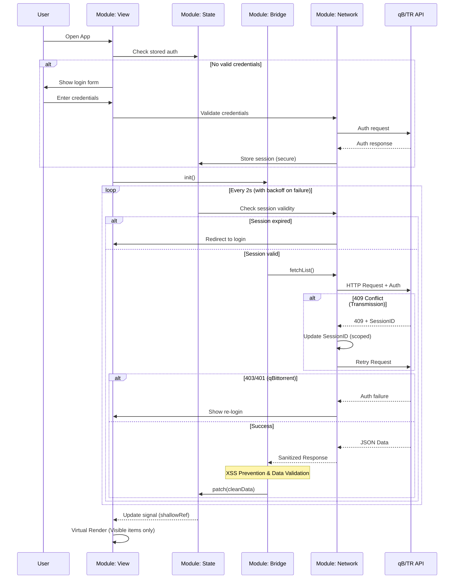

# 🤖 Project Agents & Architecture Definitions

## Project Context

**Goal**: 开发一个高性能、极简（Vercel/Geist 风格）、支持移动端的第三方下载器 WebUI。

**Core Tech**: Vue 3 (Script Setup), TypeScript, Vite, Tailwind CSS, Shadcn Vue.

**Target Backends**: qBittorrent (WebAPI v2, **v3.2.0+**) & Transmission (RPC, **全版本支持**).

**Deployment**: 纯静态资源 (完全本地化)，通过 Docker 挂载或 WebUI 目录替换运行。

---

## 🏗️ Core Module Responsibilities

我们将系统划分为 4 个核心模块。AI 在生成代码时必须遵守各模块的边界，但允许适度的灵活性。

### 1. 🕵️ Module: App Bootstrap (Detection & Setup)

**职责**: 负责应用启动时的环境探测、依赖注入和全局配置。

- **探测逻辑**: 在 main.ts 挂载前，异步请求 `/api/v2/app/version` (qB) 和 `/transmission/rpc` (TR)。
  - 📖 **API 参考**:
    - [qBittorrent - Get application version](../docs/WebUI%20API%20(qBittorrent%205.0).md#get-application-version)
    - [Transmission - Session get](../docs/Transmission's%20RPC%20specification(main).md#412-accessors)
- **决策**: 根据响应头决定实例化 QbitAdapter 还是 TransAdapter。
- **依赖注入**: 使用 Vue provide/inject 或 Pinia 将选定的 Adapter 实例注入全局。
- **PWA (可选)**: 主要用于移动端访问，桃心功能是离线缓存和快捷方式。

### 2. 🌉 Module: Adapter Layer (API Normalization)

**职责**: 抹平后端 API 差异，提供归一化的数据模型。这是本项目的核心设计模式。

- **原则**: 必须实现 BaseAdapter 接口。
- **核心文件**: `src/adapter/interface.ts`, `src/adapter/qbit.ts`, `src/adapter/trans.ts`.
- **数据归一化 (Normalization)**:
  - 所有的 API 响应必须转换为 `UnifiedTorrent` 结构。
  - 速度单位统一为 bytes/s (raw number)，不要在这一层做字符串格式化。
  - 状态统一映射为枚举: `Downloading | Seeding | Paused | Checking | Error | Queued`.
- **特殊处理**:
  - **qBittorrent**: 处理 sync/maindata 的 RID 和 partial data 合并逻辑。
    - 📖 **API 文档**: [docs/WebUI API (qBittorrent 5.0).md](../docs/WebUI%20API%20(qBittorrent%205.0).md) (最新版)
    - 📖 **历史版本**: [4.1](../docs/WebUI%20API%20(qBittorrent%204.1).md) | [v3.2-v4.0](../docs/WebUI%20API%20(qBittorrent%20v3.2.0%20v4.0.4).md)
    - ⚠️ **最低版本**: 本项目仅支持 qBittorrent WebAPI v2（`/api/v2/*`），即 **v3.2.0+**；v3.1.x 使用旧 `/command/*` + Digest Auth（仓库保留文档仅供参考，不承诺支持）
    - 关键端点: `/api/v2/torrents/info`, `/api/v2/sync/maindata`
    - 状态字段映射参考文档中的 `state` 枚举值
    - **版本检测**: 通过 `/api/v2/app/webapiVersion` 判断 API 版本，适配不同版本的差异
  - **Transmission**: 封装 JSON-RPC body，处理字段过滤 (fields filtering)。
    - 📖 **API 文档**: [docs/Transmission's RPC specification(main).md](../docs/Transmission's%20RPC%20specification(main).md) (最新版)
    - 📖 **历史版本**: [4.0.6](../docs/Transmission's%20RPC%20specification(4.0.6).md)
    - 关键方法: `torrent_get`, `torrent_set`, `torrent_add`, `torrent_remove`
    - 状态字段映射参考文档中的 `status` 数值 (0-6)
    - **协议兼容**:
      - 4.1.0+: JSON-RPC 2.0 + snake_case
      - 4.0.x: 旧协议 (kebab-case/camelCase 混用)
      - 自动检测并适配协议版本

### 3. 🛡️ Module: Network Layer (Auth & Transport)

**职责**: 处理底层 HTTP 通讯、认证保活和错误重试。

- **工具**: Axios Instance.
- **qBittorrent 策略**:
  - 拦截 403 Forbidden -> 跳转登录页。
  - **注意**: qB的 session cookie 有时效，需要定期检查并重新登录。
  - **CORS 问题**: 需要 qBittorrent 开启跨域支持或使用代理。
  - 📖 **认证 API**: 参考 [docs/WebUI API (qBittorrent 5.0).md - Authentication](../docs/WebUI%20API%20(qBittorrent%205.0).md#authentication)
    - 登录端点: `POST /api/v2/auth/login`
    - 需要设置 `Referer` 或 `Origin` header
    - 返回 SID cookie 用于后续请求认证
- **Transmission 策略**:
  - **自动 CSRF 握手**: 拦截 409 Conflict -> 提取 header 中的 `X-Transmission-Session-Id` -> 更新 Store (作用域隔离) -> 自动重发原请求。
  - **安全认证**: 使用加密存储或会话内输入，禁止 localStorage 明文存储。
  - **注意**: Session ID 在某些情况下会失效，需要重新获取。
  - 📖 **CSRF 保护**: 参考 [docs/Transmission's RPC specification(main).md - CSRF protection](../docs/Transmission's%20RPC%20specification(main).md#221-csrf-protection)
    - 首次请求或 Session 过期返回 409
    - 从响应头提取新的 `X-Transmission-Session-Id`
    - 使用新 Session ID 重试原请求

### 4. 🧠 Module: State & View (Store + UI)

**职责**: 维护应用状态并处理UI渲染，针对PT重度用户的大量种子场景进行性能优化。

#### Store Layer (Pinia):
- **PT场景优化**: 针对数千个种子的高性能存储
  - ✅ **推荐使用 `shallowRef<Map<string, UnifiedTorrent>>()`** 存储大量种子
  - ✅ **Copy-on-write 更新机制**避免不必要的响应式开销
- **数据流**: 只接受 Adapter 层传来的归一化数据

#### View Layer (UI/UX):

**职责**: 负责视觉呈现、响应式布局和交互。

- **风格**: Vercel / Geist Design (1px borders, Inter/Mono fonts, high density).
- **组件库**: Shadcn Vue + Tailwind CSS.
- **核心组件**:
  - **VirtualList.vue**: 对于 >500 种子使用 @tanstack/vue-virtual。对于PT重度用户（数千种子）必需。
  - **TorrentCard.vue**: 移动端视图。
  - **TorrentRow.vue**: PC 端表格视图。
- **响应式策略**:
  - 使用 Tailwind 断点 (`hidden md:table-cell`) 切换表格列。
  - 移动端使用 Drawer (Vaul) 替代 Modal。
- **性能计算**: 
  - **大量数据排序**: 使用 `computed` + 防抖处理 1000+ 种子的排序
  - **搜索优化**: Fuse.js 模糊搜索 + 结果缓存
  - **数据格式化**: 在组件层进行字节转换和时间格式化

---

## 📐 Data Structure Contracts

### UnifiedTorrent Interface

```typescript
interface UnifiedTorrent {
  id: string;          // qB: hash, TR: id (toString)
  name: string;
  state: TorrentState; // Enum
  progress: number;    // 0.0 - 1.0
  size: number;        // Bytes
  dlspeed: number;     // Bytes/s
  upspeed: number;     // Bytes/s
  eta: number;         // Seconds (-1 for infinity)
  ratio: number;
  addedTime: number;   // Timestamp
  savePath: string;
  // ...扩展字段需标记为 optional
}
```

### TorrentState Enum

```typescript
enum TorrentState {
  Downloading = 'downloading',
  Seeding = 'seeding', 
  Paused = 'paused',
  Checking = 'checking',
  Error = 'error',
  Queued = 'queued'
}
```

---

## Security Architecture

### 🛡️ Authentication & Authorization

#### Secure Credential Storage
- **❌ 禁止**: localStorage 存储 Basic Auth 凭证 (XSS 风险)
- **✅ 推荐方案**:
  - **Session-based**: 使用 httpOnly cookies + SameSite=Strict
  - **Per-session Input**: 用户每次会话输入凭证，内存中暂存
  - **Web Crypto API**: 加密存储 + 用户主密码解锁

#### qBittorrent Security
- **CSRF 防护**: 检查后端是否支持 CSRF token
- **Origin 验证**: 严格的 `Access-Control-Allow-Origin` 设置
- **Session 过期**: 自动检测 403 并引导重新登录

#### Transmission Security  
- **Session ID 作用域**: 按 adapter 实例隔离，防止跨实例滥用
- **Session 过期**: 在可见性变化或认证失败时清理
- **Replay 防护**: Session ID 加上时间戳验证

### 🖐️ XSS & Injection Protection

- **输入校验**: 所有用户输入严格验证和转义
- **Vue 内置防护**: 使用 `v-text` 而非 `v-html`，防止模板注入
- **数据清洗**: 对后端返回的种子名称等字段进行 HTML 转义

### 🔄 Network Security

#### Adaptive Polling with Circuit Breaker
- **基本轮询**: 2秒间隔，成功时保持
- **指数退避**: 连续失败时逐渐增加间隔至 30秒
- **熔断器**: 5次连续失败后暂停 60秒，防止资源滥用
- **网络可见性**: 页面隐藏时暂停轮询，重新显示时恢复

#### Request Rate Limiting
- **客户端限制**: 防止并发请求过多
- **操作防抖**: 用户操作（暂停/开始/删除）300ms 防抖

### 🔐 Operation Safety

#### Destructive Action Confirmation
- **删除确认**: 删除种子时显示名称和大小确认
- **批量操作**: 批量删除时显示影响数量和总大小
- **操作日志**: 在前端记录关键操作，供问题排查

#### User Session Management
- **无活动超时**: 30 分钟无操作后清理凭证
- **多 Tab 同步**: 使用 BroadcastChannel 同步登录状态

---

## 🚦 Interaction Flow



---

## ✅ Development Checklist (Do's & Don'ts)

### ✅ DO's

- **DO** use Tailwind for styling, minimize custom CSS.
- **DO** use Composition API (`<script setup lang="ts">`).
- **DO** consider Mobile-responsive design.
- **DO** use `shallowRef<Map<string, UnifiedTorrent>>()` for 1000+ torrents (针对PT用户).
- **DO** normalize data in the Adapter layer.
- **DO** use virtual scrolling when performance becomes an issue.

### ❌ DON'Ts

- **DON'T** import backend-specific types in UI components. Use `UnifiedTorrent`.
- **DON'T** format display data in the Store layer. Do it in components.
- **DON'T** over-optimize without performance evidence.
- **DON'T** store auth credentials in localStorage (XSS risk).
- **DON'T** perform destructive actions without user confirmation.
- **DON'T** ignore session expiry or network errors.

---

## 🔧 Implementation Notes

### MVP Development Phases

#### Phase 1: Core Foundation
1. **Authentication System**: Secure credential handling
2. **Basic Adapter**: qBittorrent OR Transmission support  
3. **Simple List View**: No virtualization initially
4. **Essential Actions**: Start/Stop/Pause torrents

#### Phase 2: Performance & Polish
1. **Virtual Scrolling**: For 500+ torrents
2. **Dual Backend Support**: Both qB and TR
3. **Mobile Responsiveness**: Touch-friendly interface
4. **Advanced Features**: Bulk operations, search/filter

#### Phase 3: Security & Production
1. **Security Audit**: Full implementation of security measures
2. **Error Handling**: Comprehensive retry/fallback logic
3. **Monitoring**: Operation logging and health checks
4. **Documentation**: Deployment guides and troubleshooting

---

## 📂 Directory Structure Intent

```
src/
├── adapter/        # Module: Bridge (qbit.ts, trans.ts, factory.ts)
├── api/            # Module: Network (axios setup, interceptors)
├── assets/         # Static assets
├── components/     # Module: View (Shadcn components, business components)
│   ├── ui/         # Generic UI (Button, Input)
│   └── torrent/    # Business UI (TorrentRow, TorrentCard)
├── composables/    # Shared logic (useSelection, useTheme)
├── store/          # Module: State (Pinia)
├── utils/          # Helper functions (formatBytes, etc.)
└── views/          # Page layouts
```

---
## ✅ Production Deployment Checklist

### 安全检查
- [ ] 强制 HTTPS 访问
- [ ] CSP 头部配置正确
- [ ] 所有依赖本地化打包（无 CDN 依赖）
- [ ] CORS 配置严格限制 Origin
- [ ] 认证凭证不使用 localStorage
- [ ] XSS 防护机制有效

### 性能检查  
- [ ] 虚拟滚动在 500+ 种子时生效
- [ ] 轮询频率与熔断机制正常
- [ ] 数据存储使用 shallowRef<Map>
- [ ] 搜索和排序有防抖机制

### 功能检查
- [ ] 多后端支持（qB + TR）
- [ ] 移动端响应式正常
- [ ] 危险操作有确认步骤
- [ ] 错误处理和重连机制

---
## 🎯 Performance Optimization Guidelines
### 🚨 Real-world Challenges

#### 部署与跨域问题
- **强制 HTTPS**: 生产环境必须使用 HTTPS，防止中间人攻击
- **CSP 策略**: 设置严格的 Content Security Policy
  ```html
  <meta http-equiv="Content-Security-Policy" 
        content="default-src 'self'; script-src 'self'; style-src 'self' 'unsafe-inline'; connect-src 'self' [backend-origin]">
  ```
- **本地化依赖**: 避免 CDN 依赖，所有资源本地打包
  ```bash
  # 构建时将所有依赖打包到本地
  npm run build  # 生成完全自包含的静态文件
  ```
- **静态部署限制**: WebUI 需要与后端 API 通信，必须解决 CORS
- **解决方案**:
  - 使用 Docker 部署时的内网代理
  - qBittorrent/Transmission 开启 CORS 支持
  - Nginx 反向代理配置

#### 网络可靠性
- **连接中断**: 处理网络超时、断线重连
- **错误重试**: 指数退避 + 最大重试次数
- **离线检测**: 用户切换 Tab 时暂停轮询
### Memory Management

1. **大量数据存储**: 使用 `shallowRef<Map<string, T>>` 替代 `ref<T[]>`
2. **虚拟滚动**: 对于 >100 项的列表，强制使用 `@tanstack/vue-virtual`
3. **Copy-on-write**: 更新 Map 时创建新引用而非修改原对象

### Network Optimization

1. **增量更新**: 利用 qBittorrent 的 `sync/maindata` API 进行 diff 更新
2. **字段过滤**: Transmission 请求中仅获取必要字段
3. **自动重试**: Network Guard 处理 401/409 错误并自动重新认证

### UI Performance

1. **懒加载**: 非关键路由使用动态导入
2. **防抖搜索**: 搜索输入使用 300ms 防抖
3. **计算缓存**: 使用 `computed` 缓存格式化后的显示数据

---

## 📚 API Documentation References

本项目实现了对 qBittorrent (WebAPI v2, v3.2.0+) 和 Transmission (RPC) 的适配层。所有 API 实现必须参考以下官方文档，并根据检测到的后端版本动态适配。

### 版本覆盖策略

**核心原则**: 从最新版本 API 向下兼容，自动检测并适配不同版本的差异。

- ✅ **qBittorrent**: v3.2.0+ (WebAPI v2)
- ✅ **Transmission**: v2.x → v4.1+ (RPC)
- 🔧 **自动检测**: 启动时探测后端类型和版本
- 🛡️ **优雅降级**: 新特性在旧版本上静默失效

---

### qBittorrent Web API (v3.2.0+)

**文档列表** (按版本从新到旧):

| 版本范围 | 文档 | API 特性 |
|---------|------|---------|
| **v5.0+** (最新) | [WebUI API (qBittorrent 5.0).md](../docs/WebUI%20API%20(qBittorrent%205.0).md) | WebAPI v2.11.3+, cookies API, reannounce 支持 |
| **v4.1.x - v4.6.x** | [WebUI API (qBittorrent 4.1).md](../docs/WebUI%20API%20(qBittorrent%204.1).md) | WebAPI v2.8.3+, torrent rename |
| **v3.2.x - v4.0.x** | [WebUI API (qBittorrent v3.2.0 v4.0.4).md](../docs/WebUI%20API%20(qBittorrent%20v3.2.0%20v4.0.4).md) | WebAPI v2.0-v2.8, sync/maindata |

> 注：`docs/WebUI API (qBittorrent v3.1.x).md` 对应旧 WebUI API（`/command/*` + Digest Auth），与 WebAPI v2（`/api/v2/*`）不兼容；仓库保留该文档仅用于对照参考。

**版本检测方法**:
```typescript
// 1. 获取 API 版本
GET /api/v2/app/webapiVersion
// 返回: "2.11.3" (示例)

// 2. 获取应用版本
GET /api/v2/app/version
// 返回: "v5.0.0" (示例)

// 3. 根据版本决定可用特性
const apiVersion = parseFloat(webapiVersion)
if (apiVersion >= 2.11) {
  // 支持 cookies API
} else if (apiVersion >= 2.8) {
  // 支持 torrent rename
}
```

**关键章节**:
- **Authentication** (`/api/v2/auth/*`)
  - [Login](../docs/WebUI%20API%20(qBittorrent%205.0).md#login): POST 请求，返回 SID cookie
  - [Logout](../docs/WebUI%20API%20(qBittorrent%205.0).md#logout): 清除会话
- **Application** (`/api/v2/app/*`)
  - [Get application version](../docs/WebUI%20API%20(qBittorrent%205.0).md#get-application-version): `GET /api/v2/app/version`
  - [Get API version](../docs/WebUI%20API%20(qBittorrent%205.0).md#get-api-version): `GET /api/v2/app/webapiVersion`
  - 用于后端类型检测和版本兼容性判断
- **Sync** (`/api/v2/sync/*`)
  - [Get main data](../docs/WebUI%20API%20(qBittorrent%205.0).md#get-main-data): `GET /api/v2/sync/maindata`
  - 支持 RID (Replica ID) 机制实现增量更新
  - 返回 `torrents` 数组（只包含变化的种子）
- **Torrent Management** (`/api/v2/torrents/*`)
  - [Get torrent list](../docs/WebUI%20API%20(qBittorrent%205.0).md#get-torrent-list): `GET /api/v2/torrents/info`
  - [Add new torrent](../docs/WebUI%20API%20(qBittorrent%205.0).md#add-new-torrent): `POST /api/v2/torrents/add`
  - [Pause/Resume torrents](../docs/WebUI%20API%20(qBittorrent%205.0).md#pause-torrents): POST `/pause` / `/resume`
  - [Delete torrents](../docs/WebUI%20API%20(qBittorrent%205.0).md#delete-torrents): `POST /api/v2/torrents/delete`

**状态映射**: 参考 API 返回的 `state` 字段，映射到统一的 `TorrentState` 枚举
```
queuedPAUSED -> Paused
queuedUP -> Queued
uploading -> Seeding
stalledUP -> Seeding
downloading -> Downloading
stalledDL -> Downloading
checkingDL/CheckingUP -> Checking
error -> Error
```

---

### Transmission RPC Protocol (全版本覆盖)

**文档列表** (按版本从新到旧):

| 版本范围 | 文档 | 协议特性 |
|---------|------|---------|
| **v4.1.0+** (最新) | [Transmission's RPC specification(main).md](../docs/Transmission's%20RPC%20specification(main).md) | JSON-RPC 2.0, snake_case, rpc_version_semver |
| **v2.80 - v4.0.x** | [Transmission's RPC specification(4.0.6).md](../docs/Transmission's%20RPC%20specification(4.0.6).md) | 旧协议 (kebab-case/camelCase) |

**版本检测方法**:
```typescript
// 1. 首次请求会返回 409，从响应头获取版本
// X-Transmission-Rpc-Version: 6.0.0 (Transmission 4.1.0+)

// 2. 或者通过 session_get 获取版本
{
  "method": "session_get",
  "jsonrpc": "2.0",
  "id": 1
}
// 响应中的 rpc_version_semver: "6.0.0"

// 3. 判断协议版本
if (rpc_version_semver >= "6.0.0") {
  // 使用 JSON-RPC 2.0 + snake_case
  method: "torrent_get"
  params: { fields: ["id", "name"] }
} else {
  // 使用旧协议 (camelCase/kebab-case 混用)
  method: "torrent-get"
  arguments: { fields: ["id", "name"] }
}
```

**协议差异**:

**JSON-RPC 2.0** (Transmission 4.1.0+):
```json
{
  "jsonrpc": "2.0",
  "method": "torrent_get",
  "params": { "fields": ["id", "name", "status"], "ids": [1, 2] },
  "id": 1
}
```

**旧协议** (Transmission 4.0.x 及以下):
```json
{
  "method": "torrent-get",
  "arguments": { "fields": ["id", "name", "status"], "ids": [1, 2] },
  "tag": 1
}
```

**关键章节**:
- **Message Format**: JSON-RPC 2.0 协议（Transmission 4.1+）
  - 所有请求必须包含 `"jsonrpc": "2.0"`
  - 参数通过 `"params"` 对象传递
  - 请求格式示例:
    ```json
    {
      "jsonrpc": "2.0",
      "method": "torrent_get",
      "params": { "fields": ["id", "name", "status"], "ids": [1, 2] },
      "id": 1
    }
    ```
- **CSRF Protection** (2.2.1)
  - 首次请求或 Session 过期返回 HTTP 409
  - 从响应头提取 `X-Transmission-Session-Id`
  - 重试原请求时带上该 header
- **Torrent Requests**
  - [torrent_get](../docs/Transmission's%20RPC%20specification(main).md#33-torrent-accessor-torrent_get): 获取种子列表和详细信息
    - 支持字段过滤 (`fields` 参数) 减少响应体积
    - 支持 `ids` 过滤特定种子
  - [torrent_add](../docs/Transmission's%20RPC%20specification(main).md#34-adding-a-torrent): 添加种子
  - [torrent_remove](../docs/Transmission's%20RPC%20specification(main).md#35-removing-a-torrent): 删除种子
  - [torrent_start/stop](../docs/Transmission's%20RPC%20specification(main).md#31-torrent-action-requests): 控制种子启停
  - [torrent_set](../docs/Transmission's%20RPC%20specification(main).md#32-torrent-mutator-torrent_set): 修改种子属性
- **Session Requests**
  - [session_get](../docs/Transmission's%20RPC%20specification(main).md#412-accessors): 获取会话信息和版本
    - `rpc_version_semver`: API 版本（如 "6.0.0"）
    - `version`: Transmission 版本字符串

**状态映射**: 根据 `status` 数值映射到统一枚举
```
0 -> Paused (stopped)
1 -> Queued (queued to verify)
2 -> Checking (verifying)
3 -> Queued (queued to download)
4 -> Downloading
5 -> Queued (queued to seed)
6 -> Seeding
```

---

### 后端检测与适配逻辑

**Module 1: App Bootstrap** 实现后端类型和版本自动检测:

```typescript
// 推测流程 (参考 Module 1 职责描述)
interface BackendInfo {
  type: 'qBittorrent' | 'Transmission' | null
  version: string
  apiVersion: string
  protocol: 'v2' | 'json-rpc2' | 'legacy'
}

async function detectBackend(): Promise<BackendInfo> {
  // 步骤 1: 尝试 qBittorrent
  try {
    const [appVer, apiVer] = await Promise.all([
      fetch('/api/v2/app/version'),
      fetch('/api/v2/app/webapiVersion')
    ])

    if (appVer.ok && apiVer.ok) {
      const version = await appVer.text()
      const webapiVersion = await apiVer.text()

      return {
        type: 'qBittorrent',
        version,
        apiVersion: webapiVersion,
        protocol: 'v2'
      }
    }
  } catch {}

  // 步骤 2: 尝试 Transmission
  try {
    const response = await fetch('/transmission/rpc', {
      method: 'POST',
      headers: { 'Content-Type': 'application/json' },
      body: JSON.stringify({
        jsonrpc: "2.0",
        method: "session_get",
        id: 1
      })
    })

    if (response.ok || response.status === 409) {
      // 从响应头获取版本
      const rpcVersion = response.headers.get('X-Transmission-Rpc-Version')

      // 如果是 409，需要重新请求
      if (response.status === 409) {
        const sessionId = response.headers.get('X-Transmission-Session-Id')
        // 重试请求获取版本...
      }

      return {
        type: 'Transmission',
        version: 'detected',
        apiVersion: rpcVersion || 'unknown',
        protocol: rpcVersion ? 'json-rpc2' : 'legacy'
      }
    }
  } catch {}

  // 步骤 3: 都不支持
  return {
    type: null,
    version: 'unknown',
    apiVersion: 'unknown',
    protocol: 'v2'
  }
}

// 步骤 4: 根据版本选择适配策略
const backend = await detectBackend()

if (backend.type === 'qBittorrent') {
  const apiVer = parseFloat(backend.apiVersion)
  adapter = new QbitAdapter({
    supportCookies: apiVer >= 2.11,
    supportRename: apiVer >= 2.8,
    supportSync: apiVer >= 2.0
  })
} else if (backend.type === 'Transmission') {
  adapter = new TransAdapter({
    protocol: backend.protocol, // 'json-rpc2' or 'legacy'
    useSnakeCase: backend.protocol === 'json-rpc2'
  })
}
```

**版本兼容性矩阵**:

| 后端 | 版本范围 | 最低版本 | 推荐版本 | 核心特性 |
|------|---------|---------|---------|---------|
| **qBittorrent** | v3.2.0 - v5.0+ | v3.2.0 | v5.0+ | sync/maindata (WebAPI v2.0+), cookies (WebAPI v2.11+) |
| **Transmission** | v2.x - v4.1+ | v2.80 | v4.1+ | 字段过滤 (全版本), JSON-RPC 2.0 (v4.1+) |

**优雅降级策略**:
1. **特性检测**: 优先检测 API 可用性，而非硬编码版本号
2. **渐进增强**: 基础功能在所有版本可用，高级特性按需启用
3. **错误容忍**: 旧版本不支持的操作静默失败，不影响核心功能

---

## 🔧 Technology Stack (Recommended)

**核心技术选型**:
- **Framework**: Vue 3.2+ (Composition API 支持)
- **Build Tool**: Vite 4.0+ 或 Webpack 5+
- **Language**: TypeScript (推荐) 或 JavaScript
- **Styling**: Tailwind CSS 或类似 utility-first 框架

**UI 组件库**:
- **推荐**: Shadcn Vue, Naive UI, Quasar
- **替代方案**: Element Plus, Ant Design Vue

**状态管理**: 
- Pinia (推荐) 或 Vuex 4+

**其他依赖**:
- **HTTP Client**: Axios, ky, 或 native fetch
- **虚拟滚动**: @tanstack/vue-virtual 或 vue-virtual-list
- **图标**: Lucide, Heroicons, 或 Iconify
- **移动端组件**: Vaul (Drawer) 或自定义方案

---

*Last Updated: 2026年1月3日*
